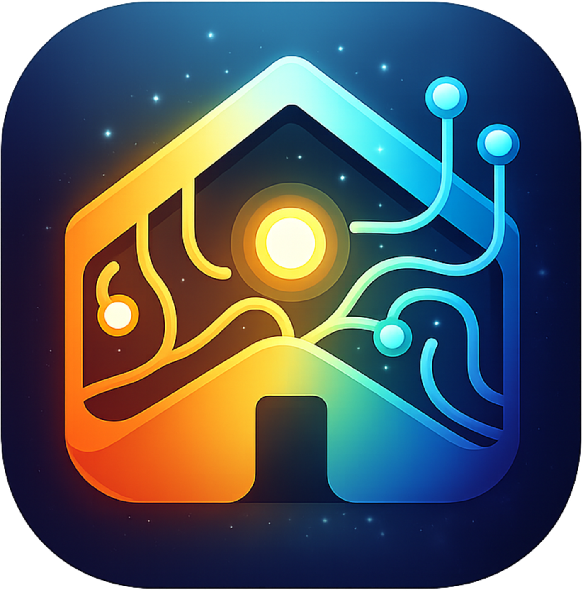

# Holms

<p align="center">
  
</p>

AI-driven home automation coordinator powered by Claude. Instead of rigid if-then rules, Holms uses an LLM agent that observes your home, learns your preferences over time, and acts autonomously — while deferring to you on anything it's unsure about.

## How it works

A daemon process connects to your smart home devices and feeds events to a Claude agent via the [Claude Agent SDK](https://docs.anthropic.com/en/docs/claude-code/sdk). The agent has access to tools for querying device state, executing commands, storing memories, creating fast local automation rules (reflexes), and spawning deep reasoning sub-agents for complex multi-device decisions. A plugin system lets you extend the agent with local Claude Code extensions. A React frontend gives you a dashboard to monitor everything, chat with the agent, and approve or reject proposed actions.

### The agent loop

```
Device event arrives
       ↓
  ┌────┴────┐
  ↓         ↓
Reflex    Triage engine classifies event
Engine    (immediate / batch / silent)
(instant)        ↓
            Coordinator receives event(s)
                 ↓
          Agent recalls memories & reasons
                 ↓
          ┌──────┼──────────────┐
          ↓      ↓              ↓
      Routine  Novel        Uncertain
      (act)    (act +       (propose action,
               remember)    wait for approval)
          ↓      ↓              ↓
          ↓  Deep reason   ApprovalQueue
          ↓  if complex     → Frontend
          ↓      ↓              ↓
       OutcomeObserver watches for reversals
                 ↓
       If reversed → feedback → agent learns
```

### Memory & learning

The agent has a free-form, embedding-based memory system. Each memory consists of:

- **content** — the actual information to remember
- **retrieval cues** — search-optimized descriptions of when this memory should surface
- **tags** — agent-chosen labels for organization (no fixed categories)

Memories are embedded using [all-MiniLM-L6-v2](https://huggingface.co/Xenova/all-MiniLM-L6-v2) vectors (384-dim, runs locally via `@huggingface/transformers`). The agent searches memories with **semantic similarity** rather than keyword matching, so a query like "bedtime routine" surfaces relevant preferences even if they don't contain those exact words.

Five memory tools give the agent full control over its own knowledge:

| Tool | Purpose |
|------|---------|
| **memory_write** | Store a new memory with content, retrieval cues, and tags |
| **memory_query** | Semantic search with optional tag/time filters; returns ranked results and metadata |
| **memory_rewrite** | Update content, cues, or tags of an existing memory (re-embeds if cues change) |
| **memory_forget** | Delete a memory that's no longer relevant |
| **memory_reflect** | Get store statistics: tag distribution, age buckets, similarity clusters, growth rate |
| **annotate_entity** | Set or update a short factual note on a device (max 300 chars); empty string clears it |
| **query_entity_notes** | Semantic search across all device annotations |

The `memory_reflect` tool supports self-maintenance — the agent can spot redundant memories (similarity clusters), track growth rate, and consolidate during reflection cycles.

When a user reverses an agent action (e.g. turns off a light the agent turned on), the outcome observer detects the reversal and sends feedback to the agent, which stores lessons learned.

### Entity annotations

The agent can attach short factual notes (max 300 chars) to individual devices using `annotate_entity`. These notes capture stable device knowledge — what it controls, known quirks, physical location details — and are automatically included in device state queries. This gives the agent baseline context about every device at the start of each cycle without needing explicit memory lookups.

Entity notes answer *"what is this thing?"* while regular memories answer *"what do I know about situations involving this thing?"*. Notes are searchable via semantic similarity, so the agent (or user) can query across all annotations — e.g. "heating devices" or "entrance area" — to find relevant devices.

### Reflexes

For time-critical automations where LLM latency is unacceptable (e.g. turning on a light when motion is detected), the agent can create **reflexes** — local rules that execute in sub-second time without AI reasoning. The agent creates and manages these rules through its tools; they run in the reflex engine independently.

### Deep reasoning

For complex situations — multi-device trade-offs, competing constraints (comfort vs. energy), or novel scenarios — the coordinator can spawn a **deep reason** sub-agent. This sub-agent has read-only access to device state, memories, schedules, reflexes, and triage rules, but cannot execute commands. It analyzes the problem and returns recommendations; the coordinator decides what to act on.

### Event triage

The agent self-manages how it gets woken up. It assigns each event source a **triage lane**:

- **immediate** — wake the agent right away
- **batch** — collect and deliver on a timer (default 2 min)
- **silent** — drop the event entirely

During reflection cycles, the agent reviews its triage rules — silencing noisy sources it never acts on, and escalating ones it missed.

### Schedules

The agent can create **scheduled tasks** — cron-like recurring actions (e.g. "turn off porch lights at 23:00"). These fire as proactive wakeups. The agent handles them directly rather than creating reflexes, and only promotes a schedule to a reflex after confirming the action never varies.

### Proactive behavior

The agent doesn't just react to events. A scheduler periodically wakes it up for:

- **Situational checks** (every 30 min) — assess current home state, act if needed
- **Reflection** (every 4 hours) — review recent actions, outcomes, and triage rules
- **Goal review** (daily) — check progress on active goals
- **Daily summary** (at 22:00) — end-of-day recap and planning

Each proactive cycle produces a one-sentence summary shown on the Overview dashboard, with full details available on expand.

### Plugins

Holms supports [Claude Code extensions](https://docs.anthropic.com/en/docs/claude-code) as plugins. Drop a Claude Code extension directory into `~/.holms/plugins/` and it will be discovered automatically. Plugins can provide MCP servers, commands, agents, skills, and hooks. Enable/disable plugins from the Plugins panel in the frontend.

## Project structure

```
packages/
├── shared/     Types shared between daemon and frontend
├── daemon/     Node.js server: tRPC API + Claude agent coordinator
└── frontend/   React dashboard: device control, chat, monitoring
```

**Daemon** runs on port 3100 and exposes a tRPC API over HTTP and WebSocket. Subsystems:

- **Coordinator** — wraps Claude Agent SDK, manages the agent session, exposes MCP tool servers (device-query, device-command, memory, reflex, approval, schedule, triage)
- **Deep Reason** — spawns a focused sub-agent for complex multi-device trade-offs, competing constraints, and novel situations; has read-only tool access (no device commands)
- **DeviceManager** — provider-based device abstraction (ships with a dummy provider for 6 simulated devices)
- **MemoryStore** — SQLite-backed persistence with local embedding vectors (all-MiniLM-L6-v2 via `@huggingface/transformers`) for semantic search
- **ReflexStore** / **ScheduleStore** / **TriageStore** — SQLite-backed persistence via better-sqlite3
- **ReflexEngine** — evaluates local automation rules on device events
- **ApprovalQueue** — routes agent actions by confidence/category, auto-executes safe ones
- **OutcomeObserver** — detects user reversals within a 5-minute observation window
- **ProactiveScheduler** — periodic wakeups for reflection, goal review, etc.; agent-created schedules for recurring tasks
- **TriageStore** — event routing rules (immediate, batch, silent) that the agent self-manages to reduce noise
- **PluginManager** — discovers and manages local Claude Code extensions in `~/.holms/plugins/`
- **EventBus** — typed pub/sub connecting all subsystems

**Frontend** runs on port 5173 (Vite dev server, proxied to daemon). Panels: Overview (proactive cycle summaries), Chat, Devices, Memory (with Entity Notes tab), Reflexes, Schedules, Activity, Plugins.

## Getting started

### Prerequisites

- Node.js 20+
- [Claude Code](https://docs.anthropic.com/en/docs/claude-code) installed and authenticated (`claude` CLI)

The daemon uses the Claude Agent SDK, which runs Claude Code under the hood — no separate API key needed.

### Install & run

```bash
npm install

# Configure (optional — defaults work out of the box)
cp packages/daemon/.env.example packages/daemon/.env

# Start both daemon and frontend
npm run dev
```

The dashboard will be at [http://localhost:5173](http://localhost:5173).

### Configuration

All config is via environment variables in `packages/daemon/.env`:

| Variable | Default | Description |
|----------|---------|-------------|
| `HOLMS_PORT` | `3100` | Daemon API port |
| `HOLMS_DB_PATH` | `./holms.db` | SQLite database path |
| `HOLMS_HF_CACHE_DIR` | `~/.holms/models` | HuggingFace model cache for embeddings |
| `HOLMS_CLAUDE_CONFIG_DIR` | `~/.claude` | Claude config directory |
| `HOLMS_PLUGINS_DIR` | `~/.holms/plugins` | Plugin discovery directory |
| `HOLMS_MODEL_COORDINATOR` | `claude-sonnet-4-6` | Model for the main coordinator agent |
| `HOLMS_MODEL_DEEP_REASON` | `claude-sonnet-4-6` | Model for deep reasoning sub-agent |
| `HOLMS_DEEP_REASON_MAX_TURNS` | `10` | Max tool-use turns for deep reasoning |

Agent behavior (batch delay, max turns, budget, proactive intervals) is configured in `packages/daemon/src/config.ts`.

### Simulated devices

The dummy provider creates 6 devices for development:

- 3 lights (living room, bedroom, kitchen) — brightness control
- 1 thermostat — target temperature, mode, gradual temperature drift
- 1 motion sensor — triggers randomly every 30–60s
- 1 door lock — lock/unlock

## Scripts

```bash
npm run dev              # Run daemon + frontend concurrently
npm run dev:daemon       # Daemon only
npm run dev:frontend     # Frontend only
npm run build            # Build all packages (shared → daemon → frontend)
```

Per-package type checking:

```bash
npm run typecheck -w @holms/daemon
npm run typecheck -w @holms/frontend
npm run typecheck -w @holms/shared
```

## Adding a device provider

Implement the `DeviceProvider` interface and register it with `DeviceManager` in `packages/daemon/src/index.ts`. See `packages/daemon/src/devices/providers/dummy.ts` for a reference implementation. The provider needs to:

1. Return device metadata and current state
2. Execute commands (turn on/off, set brightness, etc.)
3. Emit events when device state changes

## Tech stack

- **Agent**: [Claude Agent SDK](https://docs.anthropic.com/en/docs/claude-code/sdk) with in-process MCP tool servers
- **API**: [tRPC v11](https://trpc.io/) over HTTP + WebSocket
- **Database**: SQLite via [better-sqlite3](https://github.com/WiseLibs/better-sqlite3)
- **Frontend**: React 19, Vite 6, Tailwind CSS v4
- **Validation**: Zod v4
- **Language**: TypeScript (strict mode, ESM throughout)
